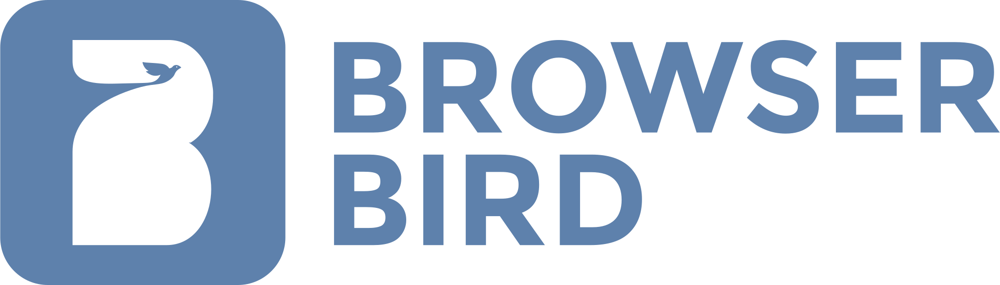

<div align="center">



**AI agents in your Slack. Persistent sessions, scheduled birds, and a live browser.**

[](LICENSE)
[](https://www.npmjs.com/package/@owloops/browserbird)
[](https://www.npmjs.com/package/@owloops/browserbird)
[](https://nodejs.org)
[](https://packagephobia.com/result?p=@owloops/browserbird)

</div>

BrowserBird connects your Slack workspace to AI agent CLI sessions. Send a message, get a real agent response with persistent context, scheduled tasks, browser automation, and a web dashboard.

```
Slack -> BrowserBird -> agent -> streaming response back to Slack
```

BrowserBird handles the thin layer: Slack adapter, session routing, bird scheduler, browser access, CLI, and web UI. The agent handles reasoning, memory, tools, MCP servers, and sub-agents.

## Features

- **Persistent sessions.** Each Slack thread maps to an agent session. Conversations continue where you left off.
- **Birds.** Schedule prompts that fly on a cron schedule and post results to Slack. Stop after a configurable error count.
- **Browser automation.** The agent controls a real Chromium browser via Playwright MCP, visible live via noVNC.
- **Multi-agent routing.** Different agents per channel, each with their own model and system prompt.
- **Job queue.** All agent invocations go through a retry-capable queue with exponential backoff.
- **Web dashboard.** Monitor sessions, flight logs, birds, and the live browser.

## Installation

### Local (npm)

Install globally and run on your own machine. Browser actions open in your local Chromium.

```bash
npm install -g @owloops/browserbird
browserbird --config browserbird.json
```

### Server (Docker)

Run on a headless server with everything pre-wired: virtual display, VNC, noVNC, Playwright, and agent CLI in containers. Watch the browser live from anywhere via the noVNC viewer.

```bash
cp .env.example .env
# Fill in SLACK_BOT_TOKEN, SLACK_APP_TOKEN, BROWSERBIRD_AUTH_TOKEN, CLAUDE_CODE_OAUTH_TOKEN

docker compose up -d
# or: podman-compose up -d
```

Pre-built images are pulled from `ghcr.io/owloops/browserbird` automatically. No local build needed.

The stack runs two containers:

```
+------------------------------+     +------------------------------+
|       vm container           |     |    browserbird container     |
|                              |     |                              |
|  cage + sway (Wayland)       |     |  Agent CLI                   |
|  wayvnc  :5900               |     |  Playwright MCP (over SSE)   |
|  noVNC   :6080               |     |  BrowserBird  :18800         |
+------------------------------+     +------------------------------+
```

> [!NOTE]
> `shm_size: 2g` is required for Chromium stability inside containers.

## Slack App Setup

1. Create a new Slack app at [api.slack.com/apps](https://api.slack.com/apps)
2. Import `manifest.json` from this repo (Settings, From an app manifest)
3. Install the app to your workspace
4. Copy **Bot User OAuth Token** to `SLACK_BOT_TOKEN`
5. Enable Socket Mode, copy **App-Level Token** to `SLACK_APP_TOKEN`

## Configuration

```bash
cp browserbird.example.json browserbird.json
```

```json
{
  "slack": {
    "botToken": "env:SLACK_BOT_TOKEN",
    "appToken": "env:SLACK_APP_TOKEN",
    "requireMention": true,
    "coalesce": { "debounceMs": 3000, "bypassDms": true },
    "permissions": { "allowChannels": ["*"], "denyChannels": [] },
    "quietHours": { "enabled": false, "start": "23:00", "end": "08:00", "timezone": "UTC" }
  },
  "agents": [{
    "id": "default",
    "name": "BrowserBird",
    "provider": "claude",
    "model": "sonnet",
    "fallbackModel": "haiku",
    "maxTurns": 50,
    "systemPrompt": "You are responding in a Slack workspace. Be concise, helpful, and natural.",
    "channels": ["*"]
  }],
  "sessions": { "ttlHours": 24, "maxConcurrent": 5, "processTimeoutMs": 300000, "longResponseMode": "snippet" },
  "database": { "retentionDays": 30, "optimizeIntervalHours": 24 },
  "browser": { "enabled": false, "mcpConfigPath": null },
  "cron": { "maxFailures": 3 },
  "web": { "enabled": true, "host": "127.0.0.1", "port": 18800, "authToken": "env:BROWSERBIRD_AUTH_TOKEN" }
}
```

<details>
<summary><strong>slack</strong></summary>

| Key | Default | Description |
|---|---|---|
| `botToken` | required | Bot user OAuth token |
| `appToken` | required | App-level token for Socket Mode |
| `requireMention` | `true` | Only respond in channels when the bot is `@mentioned`; DMs always respond |
| `coalesce.debounceMs` | `3000` | Wait N ms after last message before dispatching (group channels) |
| `coalesce.bypassDms` | `true` | Skip debouncing for DMs |
| `permissions.allowChannels` | `["*"]` | Restrict to specific channel IDs, or `"*"` for all |
| `permissions.denyChannels` | `[]` | Explicitly blocked channel IDs |
| `quietHours.enabled` | `false` | Silence the bot during specified hours |
| `quietHours.start` | `"23:00"` | Start of quiet period (HH:MM) |
| `quietHours.end` | `"08:00"` | End of quiet period (HH:MM), can wrap midnight |
| `quietHours.timezone` | `"UTC"` | IANA timezone for quiet hours |

</details>

<details>
<summary><strong>agents</strong></summary>

Each agent is scoped to specific channels. Multiple agents are matched in order, first match wins.

| Key | Default | Description |
|---|---|---|
| `id` | required | Unique agent identifier |
| `name` | required | Display name |
| `provider` | `"claude"` | Provider CLI to use |
| `model` | `"sonnet"` | Primary model |
| `fallbackModel` | none | Optional fallback when primary is unavailable |
| `maxTurns` | `50` | Max conversation turns per session |
| `systemPrompt` | none | Instructions prepended to every session |
| `channels` | `["*"]` | Channel IDs this agent handles, or `"*"` for all |

</details>

<details>
<summary><strong>sessions</strong></summary>

| Key | Default | Description |
|---|---|---|
| `ttlHours` | `24` | Session lifetime in hours (resets on each message) |
| `maxConcurrent` | `5` | Max simultaneous agent processes |
| `processTimeoutMs` | `300000` | Per-request timeout in milliseconds |
| `longResponseMode` | `"snippet"` | How to handle responses over 3900 bytes: `snippet` (file upload) or `thread` (split into chunks) |

</details>

<details>
<summary><strong>browser</strong></summary>

| Key | Default | Description |
|---|---|---|
| `enabled` | `false` | Enable Playwright MCP for the agent |
| `mcpConfigPath` | `null` | Path to your MCP config (relative or absolute) |

</details>

<details>
<summary><strong>web</strong></summary>

| Key | Default | Description |
|---|---|---|
| `enabled` | `true` | Enable the web dashboard and API |
| `host` | `"127.0.0.1"` | Bind address (`0.0.0.0` for Docker/remote) |
| `port` | `18800` | Web UI and REST API port |
| `authToken` | none | Bearer token for API auth (optional but recommended) |

</details>

### Environment variables

Values in config can reference environment variables using `"env:VAR_NAME"`. Additionally:

| Variable | Description |
|---|---|
| `SLACK_BOT_TOKEN` | Bot user OAuth token |
| `SLACK_APP_TOKEN` | App-level token for Socket Mode |
| `BROWSERBIRD_AUTH_TOKEN` | Web UI auth token |
| `CLAUDE_CODE_OAUTH_TOKEN` | Agent auth token, required for Docker (no interactive login in containers) |
| `BROWSERBIRD_RETENTION_DAYS` | Override `database.retentionDays` |
| `BROWSERBIRD_MCP_CONFIG_PATH` | Override `browser.mcpConfigPath` |
| `NO_COLOR` | Disable colored output |

## CLI

```bash
browserbird                        # Start in foreground
browserbird start                  # Start as background daemon
browserbird --config ./my.json     # Use a specific config file
browserbird doctor                 # Check agent CLI and Node.js version
```

### Birds

```bash
browserbird birds list
browserbird birds add "0 9 * * 1-5" "Summarize what happened in #general yesterday" --channel C123456
browserbird birds add "@daily" "Check the status page and report any incidents"
browserbird birds edit <id> --schedule "0 8 * * *"
browserbird birds enable <id>
browserbird birds disable <id>
browserbird birds remove <id>
browserbird birds fly <id>
browserbird birds logs <id>
```

Supported formats: standard 5-field cron (`* * * * *`) and macros (`@daily`, `@hourly`, `@weekly`, `@monthly`).

### Sessions

```bash
browserbird sessions list
browserbird sessions logs <id>
```

### Settings

```bash
browserbird settings
browserbird settings --config ./my.json
```

### Database

```bash
browserbird database cleanup
browserbird database cleanup --days 7
browserbird database logs
browserbird database logs --level warn --limit 50
browserbird database jobs
browserbird database jobs stats
browserbird database jobs retry <id>
browserbird database jobs retry --all-failed
browserbird database jobs clear --completed
browserbird database jobs clear --failed
```

## Web Dashboard

Runs at `http://localhost:18800` by default. Real-time updates via SSE.

| Page | Description |
|---|---|
| **Status** | System stats, active sessions overview |
| **Sessions** | Agent sessions with message counts, clickable to inspect full history |
| **Birds** | Scheduled birds — create, edit, enable/disable, trigger, inline flight history |
| **Browser** | Live noVNC viewer (Docker only) |
| **Settings** | Config (agents, sessions, slack, browser) + Database tab (job queue, cleanup, logs) |

## License

[FSL-1.1-MIT](LICENSE) — source available, converts to MIT after two years.

---

> [!NOTE]
> This project was built with assistance from LLMs. Human review and guidance provided throughout.
