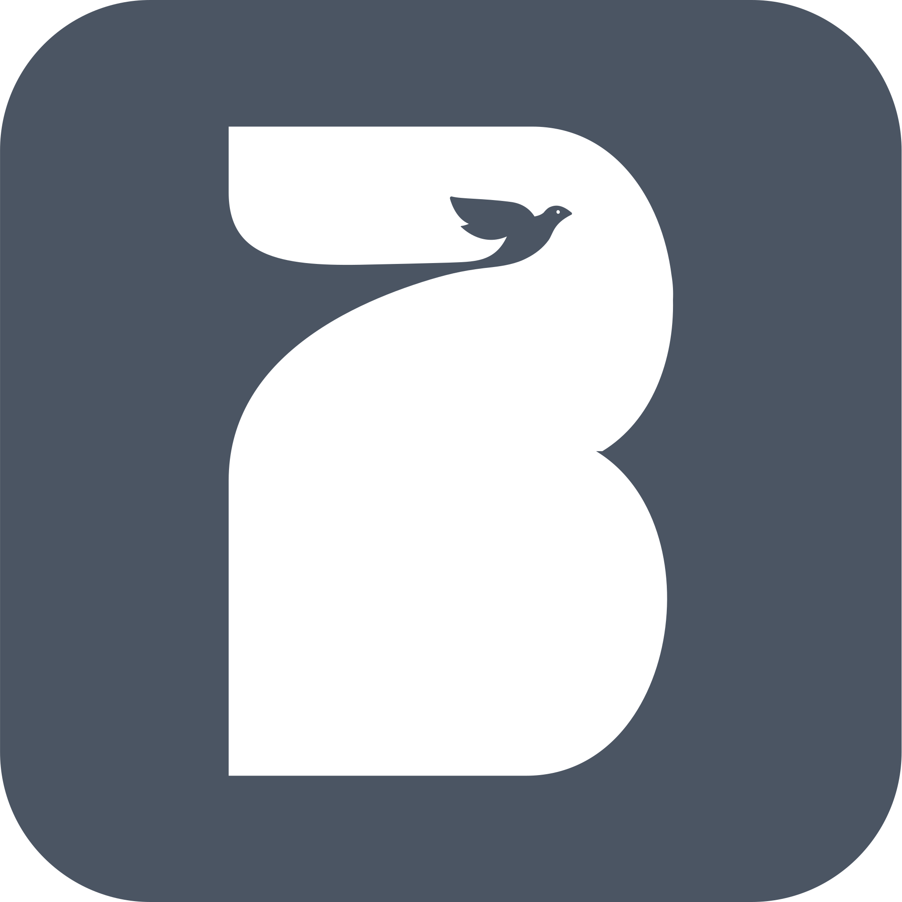
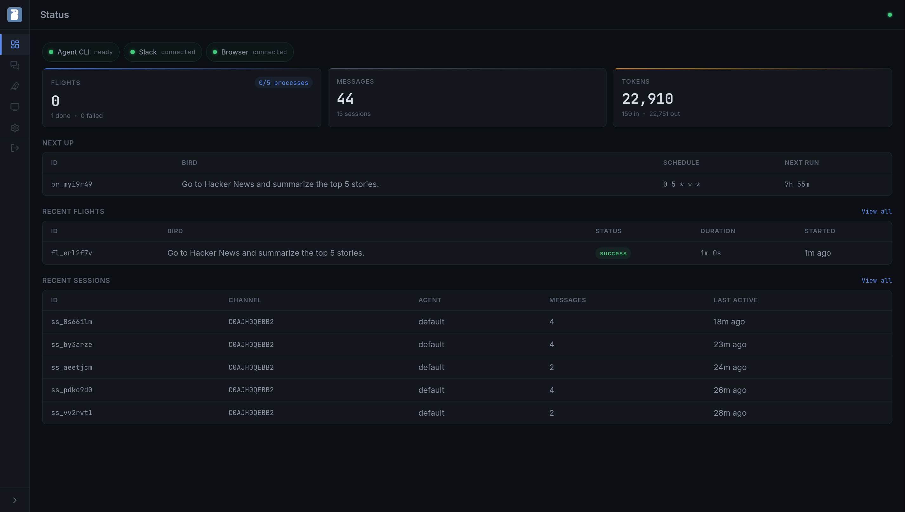

<div align="center">



# BrowserBird

Self-hosted AI agent orchestrator with a real browser, a cron scheduler, and a web dashboard.

[](LICENSE)
[](https://www.npmjs.com/package/@owloops/browserbird)
[](https://nodejs.org)

</div>

<table>
   <tr>
      <td width="50%" align="center">
         <h4>Overview</h4>
         <video src="https://github.com/user-attachments/assets/ff9bfe81-dde8-4bd2-acf5-47b48f43be9b" autoplay loop muted playsinline style="width:100%; max-width:400px;">
      </td>
      <td width="50%" align="center">
         <h4>Demo</h4>
         <video src="https://github.com/user-attachments/assets/c71791c3-ba1c-4590-8931-f3adc2dcac2d" controls style="width:100%; max-width:400px;">
      </td>
   </tr>
</table>

Schedule AI agents to run on a cron, browse the web with a real Chromium browser you can watch live through VNC, and manage everything from a web dashboard or the CLI. Chat with the agent directly from the web UI, or connect Slack for conversational threads and slash commands. BrowserBird is the orchestration layer; the agent CLI ([Claude Code](https://docs.anthropic.com/en/docs/claude-code/overview)) handles reasoning, memory, tools, and sub-agents.

Built by [Owloops](https://github.com/Owloops), building browser automation tools since 2020.

## Use Cases

Set up a bird (scheduled task) and it runs on a cron, browses the web, and posts results to your Slack channel. The browser keeps logins and cookies across runs, so it works with sites that require authentication.

| Use Case | What the bird does |
| --- | --- |
| **Competitor monitoring** | Visits competitor pages on a schedule, screenshots pricing or feature changes, and flags differences in your channel. |
| **News and mention digest** | Browses Hacker News, Reddit, or Twitter for mentions of your product or keywords, and posts a morning summary. |
| **Status page watchdog** | Checks a status page every few minutes and alerts your incidents channel when something is degraded. |
| **Dashboard screenshots** | Logs into your analytics or billing dashboard, takes screenshots of key metrics, and posts them weekly. |
| **Job and listing tracker** | Browses job boards, real estate sites, or marketplaces for new listings matching your criteria. |
| **Internal database analytics** | Deployed in your private network with read-only database access, lets non-technical teams ask questions in Slack and get structured answers with tables and trends. |

These are starting points. Every bird has a full AI agent behind it that can browse the web, run shell commands, write and analyze code, call APIs, use MCP servers, and work with any CLI tool installed in the environment.

## Installation

On first run, open the web UI and complete the onboarding wizard. It walks through agent config, API keys, and optional integrations (Slack, browser).

### Docker (recommended)

```bash
curl -fsSL https://raw.githubusercontent.com/Owloops/browserbird/main/compose.yml -o compose.yml
docker compose up -d
```

Everything is included: agent CLI, Chromium browser, VNC, and Playwright MCP. Open `http://<host>:18800` to begin onboarding.

The browser runs in **persistent** mode by default: logins and cookies are saved across sessions, one agent at a time. Set `BROWSER_MODE=isolated` in `.env` for parallel sessions with fresh contexts (requires container restart).

### Railway

[](https://railway.com/deploy/browserbird-1)

Two services are deployed: **browserbird-app** (web dashboard, API, Slack) and **browserbird-vm** (Chromium browser, VNC). Open the app service URL for the dashboard; the VM service has no web UI.

> [!IMPORTANT]
> **Region:** Deploy both services in the region closest to you. A distant region causes high VNC latency and makes interactive browser tasks nearly impossible. Both services must be in the same region.

> [!TIP]
> Enable automatic deployments in Railway service settings so new versions apply without manual intervention. The app service volume at `/app/.browserbird` persists your database and config across redeployments.

### AWS

[](https://console.aws.amazon.com/cloudformation/home#/stacks/new?stackName=browserbird&templateURL=https://browserbird-releases.s3.amazonaws.com/cloudformation/latest.yaml)

Deploys both containers as a sidecar pair on **ECS Fargate** with an ALB and EFS for persistent storage. Select your VPC and subnets from the dropdown menus, deploy the stack, then open the dashboard URL to complete onboarding (API keys, Slack, agent config).

Optional integrations (fill in at stack creation time):

- **HTTPS** - provide an ACM certificate ARN to enable TLS on the ALB.
- **Database access** - provide an RDS security group ID and the template adds an ingress rule so BrowserBird can reach your database. Store database credentials in BrowserBird's [vault keys](#vault-keys) after deployment.

After the stack is created, add a DNS record (CNAME or alias) pointing to the ALB DNS name from the stack outputs. This is required when using HTTPS so the domain matches your certificate.

> [!NOTE]
> The stack requires the `CAPABILITY_NAMED_IAM` capability (it creates an ECS task execution role and task role). CloudFormation will prompt you to acknowledge this before creating the stack.

## Slack (Optional)

[](https://api.slack.com/apps?new_app=1&manifest_json=%7B%22display_information%22%3A%7B%22name%22%3A%22BrowserBird%22%2C%22description%22%3A%22A%20self-hosted%20AI%20assistant%20in%20Slack%2C%20with%20a%20real%20browser%20and%20a%20scheduler.%22%2C%22background_color%22%3A%22%231a1a2e%22%7D%2C%22features%22%3A%7B%22assistant_view%22%3A%7B%22assistant_description%22%3A%22A%20self-hosted%20AI%20assistant%20in%20Slack%2C%20with%20a%20real%20browser%20and%20a%20scheduler.%22%7D%2C%22app_home%22%3A%7B%22home_tab_enabled%22%3Atrue%2C%22messages_tab_enabled%22%3Atrue%2C%22messages_tab_read_only_enabled%22%3Afalse%7D%2C%22bot_user%22%3A%7B%22display_name%22%3A%22BrowserBird%22%2C%22always_online%22%3Atrue%7D%2C%22slash_commands%22%3A%5B%7B%22command%22%3A%22%2Fbird%22%2C%22description%22%3A%22Manage%20BrowserBird%20birds%22%2C%22usage_hint%22%3A%22list%20%7C%20fly%20%7C%20stop%20%7C%20logs%20%7C%20enable%20%7C%20disable%20%7C%20create%20%7C%20status%22%2C%22should_escape%22%3Afalse%7D%5D%7D%2C%22oauth_config%22%3A%7B%22scopes%22%3A%7B%22bot%22%3A%5B%22app_mentions%3Aread%22%2C%22assistant%3Awrite%22%2C%22channels%3Ahistory%22%2C%22channels%3Aread%22%2C%22chat%3Awrite%22%2C%22files%3Aread%22%2C%22files%3Awrite%22%2C%22groups%3Ahistory%22%2C%22groups%3Aread%22%2C%22im%3Ahistory%22%2C%22im%3Aread%22%2C%22im%3Awrite%22%2C%22mpim%3Ahistory%22%2C%22mpim%3Aread%22%2C%22reactions%3Aread%22%2C%22reactions%3Awrite%22%2C%22users%3Aread%22%2C%22commands%22%5D%7D%7D%2C%22settings%22%3A%7B%22event_subscriptions%22%3A%7B%22bot_events%22%3A%5B%22app_mention%22%2C%22assistant_thread_context_changed%22%2C%22assistant_thread_started%22%2C%22message.channels%22%2C%22message.groups%22%2C%22message.im%22%2C%22message.mpim%22%2C%22app_home_opened%22%5D%7D%2C%22interactivity%22%3A%7B%22is_enabled%22%3Atrue%7D%2C%22org_deploy_enabled%22%3Afalse%2C%22socket_mode_enabled%22%3Atrue%2C%22token_rotation_enabled%22%3Afalse%7D%7D)

The manifest pre-configures all scopes, events, and slash commands. After creating the app, install it to your workspace and grab two tokens: the **Bot User OAuth Token** (`xoxb-...`) from OAuth & Permissions, and an **app-level token** (`xapp-...`) with `connections:write` scope from Basic Information.

### Slash Commands

Once the app is installed, `/bird` is available in any channel:

```
/bird list              Show all configured birds
/bird fly <name>        Trigger a bird immediately
/bird stop <name>       Stop a running bird
/bird logs <name>       Show recent flights
/bird enable <name>     Enable a bird
/bird disable <name>    Disable a bird
/bird create            Create a new bird (opens modal form)
/bird status            Show daemon status
```

To stop an active response in a thread, send `stop` as a message (or `@BrowserBird stop` in channels). The agent process is killed and a reaction is added to confirm.

> [!TIP]
> If `/bird` fails or routes to the wrong app, you may have another Slack app in the workspace with the same slash command. Remove or rename the duplicate from [api.slack.com/apps](https://api.slack.com/apps).

## Configuration

The onboarding wizard handles initial setup. For manual configuration, copy the example config:

```bash
cp browserbird.example.json browserbird.json
```

See [browserbird.example.json](browserbird.example.json) for the full config with defaults.

Any string value can reference an environment variable with `"env:VAR_NAME"` syntax (e.g. `"env:SLACK_BOT_TOKEN"`).

The top-level `timezone` field (IANA format, default `"UTC"`) is used for cron scheduling and quiet hours.

<details>
<summary><strong>slack</strong> - Slack connection and behavior</summary>

```json
"slack": {
  "botToken": "env:SLACK_BOT_TOKEN",
  "appToken": "env:SLACK_APP_TOKEN",
  "requireMention": true,
  "coalesce": { "debounceMs": 3000, "bypassDms": true },
  "channels": ["*"],
  "quietHours": { "enabled": false, "start": "23:00", "end": "08:00", "timezone": "UTC" }
}
```

- `botToken`, `appToken`: Optional. Bot user OAuth token and app-level token for Socket Mode. Required only for Slack integration
- `requireMention`: Only respond in channels when `@mentioned`; DMs always respond
- `coalesce.debounceMs`: Wait N ms after last message before dispatching (groups rapid messages)
- `coalesce.bypassDms`: Skip debouncing for DMs
- `channels`: Channel names or IDs to listen in, or `"*"` for all
- `quietHours`: Silence the bot during specified hours. Start/end in HH:MM format, can wrap midnight

</details>

<details>
<summary><strong>agents</strong> - Agent routing and model config</summary>

```json
"agents": [
  {
    "id": "default",
    "name": "BrowserBird",
    "model": "sonnet",
    "fallbackModel": "haiku",
    "maxTurns": 50,
    "systemPrompt": "You are responding in a Slack workspace. Be concise, helpful, and natural.",
    "channels": ["*"]
  }
]
```

Each agent is scoped to specific channels. Multiple agents are matched in order, first match wins.

- `id`, `name`: Required. Unique identifier and display name
- `model`: Short names (`sonnet`, `haiku`) or full model IDs
- `fallbackModel`: Fallback when primary model is unavailable
- `maxTurns`: Max conversation turns per session
- `systemPrompt`: Instructions prepended to every session
- `channels`: Channel names or IDs this agent handles, or `"*"` for all
- `processTimeoutMs`: Per-agent subprocess timeout override (inherits from `sessions` if not set)

</details>

<details>
<summary><strong>sessions</strong> - Session lifecycle</summary>

```json
"sessions": {
  "ttlHours": 72,
  "maxConcurrent": 5,
  "processTimeoutMs": 300000
}
```

- `ttlHours`: Hours of inactivity before a session expires. The timer resets on each message. When a session expires, the agent starts fresh with no memory of the previous conversation. Messages are still stored in BrowserBird's database, but the agent itself begins a new context. Default is 72 (3 days)
- `maxConcurrent`: Max simultaneous agent processes
- `processTimeoutMs`: Per-request timeout in milliseconds

</details>

<details>
<summary><strong>browser</strong> - Playwright MCP and VNC</summary>

```json
"browser": {
  "enabled": false,
  "mcpConfigPath": null,
  "vncPort": 5900,
  "novncPort": 6080,
  "novncHost": "localhost"
}
```

- `enabled`: Enable Playwright MCP for the agent
- `mcpConfigPath`: Path to your MCP config (relative or absolute)
- `vncPort`: VNC server port
- `novncPort`: Upstream noVNC WebSocket port
- `novncHost`: Upstream noVNC host (e.g. `"vm"` in Docker)

Browser mode (`persistent` or `isolated`) is controlled by the `BROWSER_MODE` environment variable, not the config file.

</details>

<details>
<summary><strong>birds</strong> - Scheduled task settings</summary>

```json
"birds": {
  "maxAttempts": 3
}
```

- `maxAttempts`: Max job attempts before a bird stops retrying

Each bird supports per-bird active hours set via CLI `--active-hours 09:00-17:00` or the API. Wrap-around windows (e.g. `22:00-06:00`) are supported.

</details>

<details>
<summary><strong>database</strong> - Retention policy</summary>

```json
"database": {
  "retentionDays": 30
}
```

- `retentionDays`: How long to keep messages, flight logs, jobs, and logs

</details>

<details>
<summary><strong>web</strong> - Dashboard and API server</summary>

```json
"web": {
  "enabled": true,
  "host": "127.0.0.1",
  "port": 18800,
  "corsOrigin": ""
}
```

- `enabled`: Enable the web dashboard and API
- `host`: Bind address (`0.0.0.0` for Docker/remote)
- `port`: Web UI and REST API port
- `corsOrigin`: Allowed origin for CORS headers (for cross-origin SPA hosting)

Authentication is handled via the web UI. On first visit, you create an account. All subsequent visits require login.

</details>

### Environment Variables

| Variable                  | Description                                                                                      |
| ------------------------- | ------------------------------------------------------------------------------------------------ |
| `SLACK_BOT_TOKEN`         | Bot user OAuth token (optional, for Slack integration)                                           |
| `SLACK_APP_TOKEN`         | App-level token for Socket Mode (optional, for Slack integration)                                |
| `ANTHROPIC_API_KEY`       | Anthropic API key (pay-per-token)                                                                |
| `CLAUDE_CODE_OAUTH_TOKEN` | OAuth token (uses your Claude Pro/Max subscription)                                              |
| `BROWSER_MODE`            | `persistent` (default) or `isolated`. Requires container restart                                 |
| `BROWSERBIRD_CONFIG`      | Path to `browserbird.json`. Overridden by `--config` flag                                        |
| `BROWSERBIRD_DB`          | Path to SQLite database file. Overridden by `--db` flag                                          |
| `BROWSERBIRD_VAULT_KEY`   | Vault encryption key (auto-generated on first start, stored in `.env`)                           |
| `BROWSERBIRD_VERBOSE`     | Set to `1` to enable debug logging. Same as `--verbose` flag                                     |
| `NO_COLOR`                | Disable colored output                                                                           |

> [!NOTE]
> **Agent authentication:** `ANTHROPIC_API_KEY` (pay-per-token) is required for shared or commercial deployments per Anthropic's Consumer ToS. `CLAUDE_CODE_OAUTH_TOKEN` is fine for personal self-hosted use. When both are set, OAuth takes priority. This is also why BrowserBird uses the CLI rather than the [Agent SDK](https://docs.anthropic.com/en/docs/agent-sdk/overview); the SDK requires API key auth per Anthropic's [usage policy](https://docs.anthropic.com/en/docs/claude-code/legal-and-compliance).

### Docs

Store markdown documents in `.browserbird/docs/` that get injected into the agent's system prompt at spawn time. Use them for tone guides, project context, channel-specific instructions, or any reusable prompt content.

- **File-backed.** Each doc is a `.md` file you can edit with any text editor. Drop a file in the directory and it gets auto-discovered.
- **Scoped with bindings.** Bind a doc to specific channels or birds via the web UI or CLI. Bind to `channel:*` to apply everywhere. Unbound docs are not injected (same semantics as vault keys).
- **Managed from the web UI or CLI.** Create, edit, and manage bindings from the Docs page, or use `browserbird docs` from the terminal.

### Vault Keys

Store API keys and secrets in the web UI (Settings, Keys tab) and bind them to specific channels or birds. At spawn time, bound keys are injected as environment variables into the agent subprocess.

- **Encrypted at rest** with AES-256-GCM. The encryption key is auto-generated on first start and stored in `.env` as `BROWSERBIRD_VAULT_KEY`.
- **Redacted from output.** If the agent prints a vault key value, it appears as `[redacted]` in Slack and logs.
- **Bound to targets.** A key bound to channel `*` applies to all channels. A key bound to a specific bird applies only when that bird runs. Bird-level keys override channel-level keys on name conflict.

**Example: GitHub integration.** Store a GitHub personal access token as `GITHUB_TOKEN` in the vault and bind it to a channel or bird. The agent can then create issues, open PRs, push code, review changes, and manage repositories using the GitHub API or CLI.

**Example: authenticated browsing.** For birds that need to browse logged-in sites (X, LinkedIn, etc.), export cookies from your local browser using [Cookie-Editor](https://github.com/moustachauve/cookie-editor), store the JSON as a vault key (e.g. `X_COOKIES`), and bind it to the bird. In the bird's prompt, instruct it to read the cookies from the env var and inject them via `addCookies` before browsing. Pre-injecting cookies ensures the agent starts in a logged-in state, making scheduled tasks more reliable.

## CLI

Available on npm: `npx @owloops/browserbird`


```
$ browserbird --help

   .__.
   ( ^>
   / )\
  <_/_/
   " "
usage: browserbird [command] [options]

commands:

  sessions    manage sessions and chat
  birds       manage scheduled birds
  docs        manage system prompt documents
  keys        manage vault keys
  backups     manage database backups
  config      view configuration
  logs        show recent log entries
  jobs        inspect and manage the job queue
  doctor      check system dependencies

options:

  -h, --help     show this help
  -v, --version  show version
  --verbose      enable debug logging
  --config       config file path (env: BROWSERBIRD_CONFIG)
  --db           database file path (env: BROWSERBIRD_DB)

run 'browserbird <command> --help' for command-specific options.
```

### Standalone CLI Workflow

BrowserBird works without Slack. Create a bird, trigger it, and check results from the terminal:

```bash
browserbird birds add --name "hn-digest" --schedule "0 9 * * *" --prompt "Check Hacker News for AI news and summarize"
browserbird birds fly <name>
browserbird birds flights <name>
```

## Web UI

Runs at `http://localhost:18800` by default.



| Page         | Description                                                                        |
| ------------ | ---------------------------------------------------------------------------------- |
| **Mission Control** | System overview, failing birds, upcoming runs, active sessions                |
| **Sessions**        | Chat with the agent directly, view message history, token usage, and session detail |
| **Docs**            | Markdown documents for agent system prompts, with channel/bird bindings       |
| **Birds**           | Scheduled birds: create, edit, enable/disable, trigger, inline flight history |
| **Computer**        | Live noVNC viewer (Docker only)                                               |
| **Settings** | Config editor, agent management, secrets, vault keys, system birds, job queue, and log viewer |

## Development

```bash
git clone https://github.com/Owloops/browserbird.git
cd browserbird
npm ci
```

### Run locally

```bash
cd web && npm ci && npm run build && cd ..
./bin/browserbird
```

### Docker (build locally)

```bash
cp .env.example .env
docker compose -f oci/compose.yml up -d --build
```

### Checks

```bash
npm run typecheck          # tsc --noEmit
npm run lint               # eslint
npm run format:check       # prettier
npm test                   # node --test
```

Web UI (from `web/`):

```bash
npm run check              # svelte-check
npm run format:check       # prettier
```

### Publish AWS CloudFormation template

The Launch Stack button in the README points to `s3://browserbird-releases/cloudformation/latest.yaml`. After making changes to `aws/cloudformation.yaml`, upload the new version:

```bash
aws s3 cp aws/cloudformation.yaml \
  s3://browserbird-releases/cloudformation/latest.yaml \
  --content-type "application/x-yaml" \
  --region us-east-1
```

Validate before uploading:

```bash
cfn-lint aws/cloudformation.yaml
aws cloudformation validate-template \
  --template-body file://aws/cloudformation.yaml
```

The bucket (`browserbird-releases`, account `267013046707`, us-east-1) has a public read policy scoped to the `cloudformation/` prefix so CloudFormation can fetch the template during stack creation.

## License

[FSL-1.1-MIT](LICENSE), source available, converts to MIT after two years.

> [!NOTE]
> This project was built with assistance from LLMs. Human review and guidance provided throughout.
